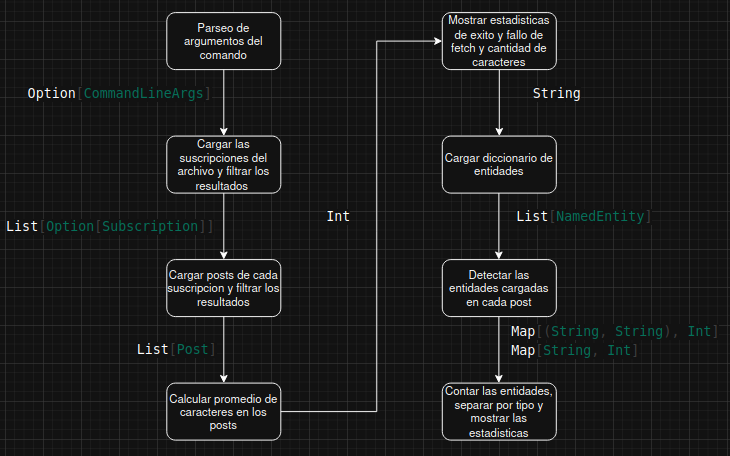

### Ejercicio 1
a) 

b)

| Paso | Abstracción |
|------|-------------|
| Parseo de argumentos del comando | No aplica |
| Cargar las suscripciones del archivo y filtrar los resultados | flatMap |
| Cargar posts de cada suscripción y filtrar los resultados | flatMap |
| Calcular promedio de caracteres en los posts | map + reduce |
| Mostrar estadísticas de éxito y fallo de fetch y cantidad de caracteres | map |
| Cargar diccionario de entidades | flatMap |
| Detectar las entidades cargadas en cada post | flatMap |
| Contar las entidades, separar por tipo y mostrar las estadisticas | reduceByKey |

Solo el parseo de argumentos no entra en las abstracciones ya que no se ejecuta sobre una colección o iterable

c) Los únicos pasos que funcionan como "barreras" son el paso de calcular promedio de caracteres y el paso de contar entidades, separar por tipo y mostrar estadisticas, y esto es porque ambos necesitan la totalidad de los datos de cada paso previo.

d) Para que puedan ejecutarse en un entorno distribuido, las funciones deberian ser serializables, deterministicas, independientes de memoria compartida, y deberian evitar dependencias, variables mutables compartidas, y otras volatilidades.

---

### Ejercicio 2

Si el error se propagase, algo tan mínimo como un solo post fallando causaría que el programa entero fallara, y sin tener manejo de errores con debug, no se podría observar la fuente del error

---

### Ejercicio 3

a) reduceByKey es una barrera porque frena toda la operación hasta que cada worker termine con su parte. Es inevitable porque en un paradigma distribuido se necesita que todos los workers tengan su parte lista para agregar los resultados

b) La función que se le pasa a reduceByKey debe ser ambos conmutativa y asociativa, aparte de serializable y determinista, para que spark pueda realizar reducciones en paralelo y agregar resultados parciales en cualquier orden.

c) Los workers leen el diccionario luego de que el driver haga un solo broadcast

### Ejercicio 4

a) Los workers no garantizan la ejecución de las transformaciones, pueden ocurrir fallos o reintentos que no tienen por que seguir la lógica del programa. Su única función es reportar información al driver, y por lo tanto, no aseguran nada más. Al usarlos en la toma de decisiones puede modificar valores según la cantidad de vecés que se ejecutó, el reintento de tareas por ejemplo podría volver un programa no determinístico.

b) Los valores de los workers están disponibles luego de operaciones terminales, en el caso de este laboratorio son las estapas de descarga, filtrado y análisis de entidades, solo en estos momentos los valores de los workers están garantizados.

c) La mayor duferencia se ve a la hora de descargar el post, pero esto se debe al lazy evaluation que hace Spark a la hora de fetchear los posts, por eso la diferencia en el filtrado no es tan significativa, al igual que en el conteo de entidades, mucho más evidente será la diferencia en la siguiente etapa.
| Etapa | Spark (s) | Secuencial (s) | Diferencia (s) |
|---------|---------:|---------------:|---------------:|
| Descarga | 0.031 | 20.665 | 20.634 |
| Filtrado | 5.499 | 10.079 | 4.580 |
| Entidades | 20.631 | 35.764 | 15.133 |
| **Total** | **26.161** | **66.508** | **40.347** |